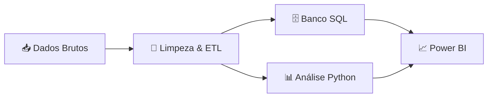

<div align="center">

# 🦟 Análise de Dados de Dengue no Brasil
### Pipeline Completo de Análise Epidemiológica (2014-2025)

[](https://www.python.org/)
[](https://pandas.pydata.org/)
[](https://www.mysql.com/)
[](https://powerbi.microsoft.com/)
[](LICENSE)

<p align="center">
  <i>Transformando dados brutos em insights acionáveis sobre a epidemia de dengue no Brasil</i>
</p>

</div>

---

## 📋 Sobre o Projeto

Este projeto implementa um **pipeline completo de análise de dados** para investigar a evolução dos casos e mortes por dengue no Brasil entre 2014 e 2025. Utilizando técnicas modernas de ciência de dados, combina dados epidemiológicos com variáveis climáticas para revelar padrões, tendências e correlações relevantes para saúde pública.

### 🎯 Objetivos

- ✅ Analisar a evolução temporal dos casos de dengue
- ✅ Identificar padrões sazonais e tendências geográficas
- ✅ Correlacionar variáveis climáticas (temperatura e precipitação) com incidência
- ✅ Mapear estados com maior crescimento epidemiológico
- ✅ Criar visualizações interativas para tomada de decisão

### 🔑 Diferenciais

```diff
+ Pipeline ETL completo: extração, transformação e carga
+ Integração de múltiplas fontes de dados (epidemiológicas + climáticas)
+ Análise estatística rigorosa com métricas de performance
+ Persistência estruturada em banco de dados SQL
+ Dashboard interativo para insights visuais
```

---

## 🏗️ Arquitetura da Solução

O projeto segue um fluxo de trabalho profissional de análise de dados:



### 🔄 Pipeline de Dados

1. **Extração** → Coleta de dados epidemiológicos e climáticos
2. **Transformação** → Limpeza, padronização e enriquecimento
3. **Carga** → Armazenamento estruturado em SQL
4. **Análise** → Exploração estatística com Python
5. **Visualização** → Dashboard interativo em Power BI

---

## 📂 Estrutura do Projeto

```
Analise_Dados_Dengue/
│
├── 📊 dados_dengue/              # Datasets brutos e processados
│   ├── raw/                      # Dados originais
│   └── processed/                # Dados tratados
│
├── 💀 dados_casos_mortes/        # Dados segregados por tipo
│   ├── casos/
│   └── obitos/
│
├── 🐍 scripts/
│   ├── extracao_clima_br.py     # Extração de dados climáticos
│   ├── dengue_csv_processor.py   # ETL e consolidação
│   └── analise.py                # Análise exploratória
│
├── 🗄️ database/
│   └── banco.sql                 # Scripts SQL (DDL/DML)
│
├── 📈 output/
│   └── output.csv                # Dataset final consolidado
│
├── 📊 powerbi/
│   └── dashboard.pbix            # Dashboard interativo (em breve)
│
├── 📋 requirements.txt           # Dependências Python
└── 📖 README.md                  # Este arquivo
```

---

## 🛠️ Stack Tecnológica

<table>
<tr>
<td align="center" width="33%">

### 🐍 Python
**Análise & ETL**

`pandas` `numpy`  
`scikit-learn`  
`matplotlib` `seaborn`

</td>
<td align="center" width="33%">

### 🗄️ SQL
**Persistência**

`MySQL/PostgreSQL`  
`Views` `Indexes`  
`Queries otimizadas`

</td>
<td align="center" width="33%">

### 📊 Power BI
**Visualização**

`DAX` `Power Query`  
`Dashboards interativos`  
`Relatórios dinâmicos`

</td>
</tr>
</table>

---

## 🚀 Instalação

### Pré-requisitos

- Python 3.8 ou superior
- Git
- Banco de dados SQL (MySQL ou PostgreSQL)

### Passo a passo

```bash
# 1. Clone o repositório
git clone https://github.com/GiovanniTT/Analise_Dados_Dengue.git
cd Analise_Dados_Dengue

# 2. Crie um ambiente virtual
python -m venv venv

# 3. Ative o ambiente virtual
# Windows
venv\Scripts\activate
# Linux/Mac
source venv/bin/activate

# 4. Instale as dependências
pip install -r requirements.txt

# 5. Configure o banco de dados
# Execute o script SQL
mysql -u seu_usuario -p < database/banco.sql
```

---

## 💻 Como Usar

### Executar Pipeline Completo

```bash
# 1. Processar dados de dengue
python scripts/dengue_csv_processor.py

# 2. Extrair dados climáticos
python scripts/extracao_clima_br.py

# 3. Executar análises
python scripts/analise.py
```

### Exemplos de Uso

<details>
<summary><b>📊 Carregar dados consolidados</b></summary>

```python
import pandas as pd

# Carregar dataset final
df = pd.read_csv('output/output.csv')

# Visualizar primeiras linhas
print(df.head())

# Estatísticas descritivas
print(df.describe())
```
</details>

<details>
<summary><b>🌡️ Analisar correlação com clima</b></summary>

```python
from analise import calcular_correlacao

# Correlação casos x temperatura
corr_temp = calcular_correlacao(df, 'casos', 'temperatura')
print(f"Correlação: {corr_temp:.3f}")

# Correlação casos x precipitação
corr_precip = calcular_correlacao(df, 'casos', 'precipitacao')
print(f"Correlação: {corr_precip:.3f}")
```
</details>

<details>
<summary><b>📈 Análise temporal por estado</b></summary>

```python
# Crescimento anual por estado
crescimento = df.groupby(['estado', 'ano'])['casos'].sum()
print(crescimento.sort_values(ascending=False).head(10))
```
</details>

---

## 📊 Análises Implementadas

### 📈 Estatísticas Descritivas

- Distribuição de casos por ano e estado
- Métricas de mortalidade (taxa de letalidade)
- Análise de outliers e valores atípicos

### 🔍 Análise Exploratória

```python
✓ Correlação de Pearson entre variáveis
✓ Regressão linear (casos vs. temperatura/precipitação)
✓ Séries temporais com decomposição sazonal
✓ Análise de tendência (crescimento/declínio)
```

### 🗺️ Crescimento Anual de Casos de Dengue por Estado

```sql

CREATE OR REPLACE
ALGORITHM = UNDEFINED
VIEW `dengue_db`.`crescimento_anual_estado` AS

SELECT
    t.estado AS estado,
    t.ano AS ano,

    t.total_casos
      - LAG(t.total_casos) OVER (
            PARTITION BY t.estado
            ORDER BY t.ano
        ) AS variacao_casos,

    (
        (
            t.total_casos
            - LAG(t.total_casos) OVER (
                PARTITION BY t.estado
                ORDER BY t.ano
              )
        )
        /
        NULLIF(
            LAG(t.total_casos) OVER (
                PARTITION BY t.estado
                ORDER BY t.ano
            ),
            0
        )
    ) * 100 AS crescimento_pct

FROM (
    SELECT
        estado,
        ano,
        SUM(casos) AS total_casos
    FROM dengue_db.dengue_dados
    GROUP BY
        estado,
        ano
) t;
```

---

## 📊 Dashboard Power BI

> 🚧 **Em Desenvolvimento** - Visualizações interativas em construção

O dashboard será composto pelos seguintes painéis:

### 📌 Visão Geral Planejada

<table>
<tr>
<td width="50%">

#### 📅 Painel Temporal
- Evolução de casos (2014-2025)
- Tendência de mortalidade
- Sazonalidade mensal

</td>
<td width="50%">

#### 🗺️ Painel Geográfico
- Mapa do Brasil por estado
- Densidade de casos
- Ranking estadual

</td>
</tr>
<tr>
<td width="50%">

#### 🌡️ Painel Climático
- Correlação temperatura × casos
- Correlação precipitação × casos
- Análise multivariada

</td>
<td width="50%">

#### 📊 Painel Comparativo
- Comparação ano a ano
- Variação percentual
- Projeções futuras

</td>
</tr>
</table>

### 🎨 Preview do Dashboard

<!-- Espaço reservado para screenshots do Power BI -->

<div align="center">

#### 🏠 Página Principal

*Visão geral com KPIs principais e evolução temporal*

---

#### 📍 Análise Geográfica

*Mapa interativo do Brasil com densidade de casos por estado*

---

#### 🌡️ Correlação Climática

*Análise de correlação entre temperatura, precipitação e casos*

---

#### 📈 Tendências e Projeções

*Análise de tendências históricas e projeções futuras*

</div>

### 🎛️ Funcionalidades Interativas

- 🔍 Filtros por ano, estado e região
- 📊 Drill-down em gráficos
- 🎚️ Segmentação por período
- 📥 Exportação de relatórios
- 🔄 Atualização automática de dados

---

## 🧪 Exemplos de Resultados

### 📉 Correlação Casos × Temperatura

```
Coeficiente de Correlação: 0.XX
P-valor: < 0.05 (estatisticamente significativo)
Interpretação: Correlação [positiva/negativa] [fraca/moderada/forte]
```

## 🔮 Roadmap

- [x] Extração e tratamento de dados
- [x] Integração com dados climáticos
- [x] Análise exploratória em Python
- [x] Persistência em banco SQL
- [ ] Dashboard Power BI completo

---

## 📄 Licença

Este projeto está sob a licença MIT. Veja o arquivo [LICENSE](LICENSE) para mais detalhes.

---

## 👨‍💻 Autor

<div align="center">

### Giovanni Micheletti

<p><i>Projeto desenvolvido para estudo e prática em Análise de Dados, Python, SQL e Business Intelligence</i></p>

</div>
