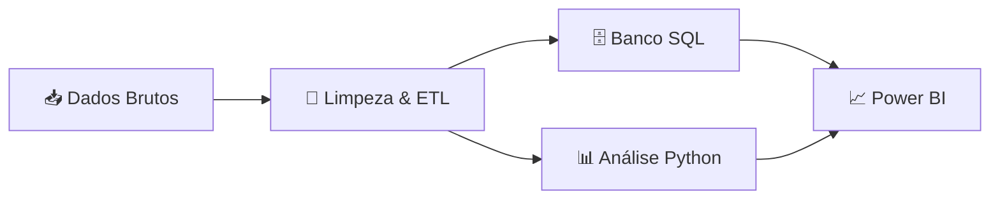
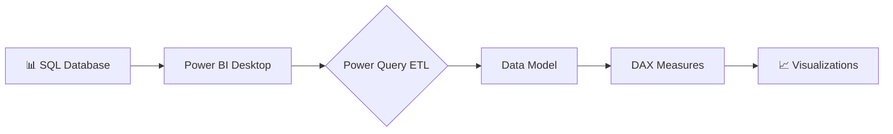

<div align="center">

<!-- Banner Hero -->


<!-- Animated typing effect -->
<p align="center">
  
</p>

<!-- Badges animados -->
[](https://www.python.org/)
[](https://pandas.pydata.org/)
[](https://www.mysql.com/)
[](https://powerbi.microsoft.com/)
[](LICENSE)

</div>

---

## 📋 Sobre o Projeto

</div>

Este projeto implementa um **pipeline completo de análise de dados** para investigar a evolução dos casos e mortes por dengue no Brasil entre 2014 e 2025. Utilizando técnicas modernas de ciência de dados, combina dados epidemiológicos com variáveis climáticas para revelar padrões, tendências e correlações relevantes para saúde pública.

### 🎯 Objetivos

- ✅ Analisar a evolução temporal dos casos de dengue
- ✅ Identificar padrões sazonais e tendências geográficas
- ✅ Correlacionar variáveis climáticas (temperatura e precipitação) com incidência
- ✅ Mapear estados com maior crescimento epidemiológico
- ✅ Criar visualizações interativas para tomada de decisão
  
### 🔑 Diferenciais Técnicos

<div align="center">

| 🚀 Feature | 💡 Descrição |
|:-----------|:-------------|
| **ETL Automatizado** | Pipeline completo de extração, transformação e carga | 
| **Data Integration** | Fusão de dados epidemiológicos + climáticos |
| **Statistical Analysis** | Correlação, regressão e séries temporais | 
| **SQL Optimization** | Views indexadas e queries otimizadas | 
| **Interactive BI** | Dashboards responsivos em Power BI | 

</div>

## 🏗️ Arquitetura da Solução

O projeto segue um fluxo de trabalho profissional de análise de dados:



### 🔄 Pipeline de Dados

1. **Extração** → Coleta de dados epidemiológicos e climáticos
2. **Transformação** → Limpeza, padronização e enriquecimento
3. **Carga** → Armazenamento estruturado em SQL
4. **Análise** → Exploração estatística com Python
5. **Visualização** → Dashboard interativo em Power BI

---

## 📂 Estrutura do Projeto

```
Analise_Dados_Dengue/
│
├── 📊 dados_dengue/              # Datasets brutos e processados
│   ├── raw/                      # Dados originais
│   └── processed/                # Dados tratados
│
├── 💀 dados_casos_mortes/        # Dados segregados por tipo
│   ├── casos/
│   └── obitos/
│
├── 🐍 scripts/
│   ├── extracao_clima_br.py     # Extração de dados climáticos
│   ├── dengue_csv_processor.py   # ETL e consolidação
│   └── analise.py                # Análise exploratória
│
├── 🗄️ database/
│   └── banco.sql                 # Scripts SQL (DDL/DML)
│
├── 📈 output/
│   └── output.csv                # Dataset final consolidado
│
├── 📊 powerbi/
│   └── dashboard.pbix            # Dashboard interativo (em breve)
│
├── 📋 requirements.txt           # Dependências Python
└── 📖 README.md                  # Este arquivo
```

---
## 🛠️ Stack Tecnológica

<div align="center">

<table align="center">
<tr>
<td align="center" width="33%" valign="top">


### 🐍 Python
**Core Analysis & ETL**

```yaml
Data Manipulation:
  - pandas: 2.0+
  - numpy: 1.24+

Visualization:
  - matplotlib: 3.7+
  - seaborn: 0.12+

Machine Learning:
  - scikit-learn: 1.3+
  - statsmodels: 0.14+
```
</td>
<td align="center" width="33%" valign="top">


### 🗄️ Database Layer
**Data Persistence**

```yaml
RDBMS:
  - MySQL: 8.0+
  - PostgreSQL: 15+

Features:
  - Indexed Views
  - Optimized Queries
  - Window Functions
  - CTEs & Subqueries


```

</td>
<td align="center" width="33%" valign="top">


### 📊 BI Platform
**Interactive Dashboards**

```yaml
Power BI:
  - DAX Formulas
  - Power Query M
  - Custom Visuals
  - Dynamic Reports

Integrations:
  - SQL Connector
  - CSV Import
  - Real-time Updates


```

</td>
</tr>
</table>

</div>

## 🚀 Instalação

### Pré-requisitos

- Python 3.8 ou superior
- Git
- Banco de dados SQL (MySQL ou PostgreSQL)

### Passo a passo

```bash
# 1. Clone o repositório
git clone https://github.com/GiovanniTT/Analise_Dados_Dengue.git
cd Analise_Dados_Dengue

# 2. Crie um ambiente virtual
python -m venv venv

# 3. Ative o ambiente virtual
# Windows
venv\Scripts\activate
# Linux/Mac
source venv/bin/activate

# 4. Instale as dependências
pip install -r requirements.txt

# 5. Configure o banco de dados
# Execute o script SQL
mysql -u seu_usuario -p < database/banco.sql
```

---

## 💻 Como Usar

### Executar Pipeline Completo

```bash
# 1. Processar dados de dengue
python scripts/dengue_csv_processor.py

# 2. Extrair dados climáticos
python scripts/extracao_clima_br.py

# 3. Executar análises
python scripts/analise.py

# 4. Visualizar Dashboard
Abra o Power BI Desktop
Abra o arquivo `powerbi/dashboard_dengue.pbix`
Atualize as conexões se necessário
Explore as visualizações interativas!
```

### Exemplos de Uso

<details>
<summary><b>📊 Carregar dados consolidados</b></summary>

```python
import pandas as pd

# Carregar dataset final
df = pd.read_csv('output/output.csv')

# Visualizar primeiras linhas
print(df.head())

# Estatísticas descritivas
print(df.describe())
```
</details>

<details>
<summary><b>🌡️ Analisar correlação com clima</b></summary>

```python
from analise import calcular_correlacao

# Correlação casos x temperatura
corr_temp = calcular_correlacao(df, 'casos', 'temperatura')
print(f"Correlação: {corr_temp:.3f}")

# Correlação casos x precipitação
corr_precip = calcular_correlacao(df, 'casos', 'precipitacao')
print(f"Correlação: {corr_precip:.3f}")
```
</details>

<details>
<summary><b>📈 Análise temporal por estado</b></summary>

```python
# Crescimento anual por estado
crescimento = df.groupby(['estado', 'ano'])['casos'].sum()
print(crescimento.sort_values(ascending=False).head(10))
```
</details>

---

## 📊 Dashboard Power BI

<div align="center">

> 🚧 **Em Desenvolvimento Ativo** - Dashboard interativo de última geração em construção

### 🎯 Visão Geral da Arquitetura BI



### 📱 Painéis Planejados

<table>
<tr>
<td width="50%" align="center">

#### 🏠 PAINEL 1: Visão Executiva


```yaml
Features:
  - 📊 KPIs Principais (Cards)
  - 📈 Linha do Tempo (2014-2025)
  - 🎯 Gauge de Crescimento
  - 🔥 Mapa de Calor Temporal
  - 📉 Tendência de Mortalidade
```

</td>
<td width="50%" align="center">

#### 🗺️ PAINEL 2: Análise Geográfica


```yaml
Features:
  - 🗺️ Mapa Choropleth do Brasil
  - 📍 Densidade por Estado
  - 🏆 Ranking Top 10
  - 🎨 Gradiente de Cores
  - 🔍 Zoom Interativo
```

</td>
</tr>
<tr>
<td width="50%" align="center">

#### 🌡️ PAINEL 3: Correlação Climática


```yaml
Features:
  - 📊 Scatter Plot Interativo
  - 📈 Linha de Tendência
  - 🌡️ Temp vs Casos
  - 🌧️ Precipitação vs Casos
  - 📉 Coeficiente de Correlação
```

</td>
<td width="50%" align="center">

#### 📈 PAINEL 4: Projeções e Trends


```yaml
Features:
  - 🔮 Previsão ARIMA
  - 📊 Decomposição Sazonal
  - 📈 Crescimento YoY
  - 🎯 Confidence Intervals
  - ⚠️ Alertas Automáticos
```

</td>
</tr>
</table>

### 🎨 Preview do Dashboard

<div align="center">

---

#### 🏠 Página 1: Analise Geral

*Visão consolidada com KPIs principais, evolução temporal e métricas críticas*

<details>
<summary>📋 <b>Especificações Técnicas</b></summary>

```yaml
Componentes:
  Cards KPI:
    - Total de Casos (11 anos)
    - Crescimento Anual (%)
    - Taxa de Letalidade
    - Estados Afetados
    - Tendência (↑↓)
  
  Gráficos:
    - Line Chart: Evolução Temporal
    - Column Chart: Casos por Ano
    - Area Chart: Mortes Acumuladas
    - Gauge: Meta vs Realizado
  
  Filtros:
    - Slicer: Ano (2014-2025)
    - Slicer: Região
    - Slicer: Estado
```

</details>

---

#### 📍 Página 2: Análise Geoespacial

*Mapa interativo com densidade de casos, drill-through por estado e análise regional*

<details>
<summary>📋 <b>Especificações Técnicas</b></summary>

```yaml
Componentes:
  Mapa Principal:
    - Tipo: Filled Map (Choropleth)
    - Cores: Gradiente (Verde → Vermelho)
    - Tooltips: Casos, Óbitos, Taxa
    - Zoom: Habilitado
  
  Tabelas:
    - Matrix: Estado × Ano × Casos
    - Ranking: Top 10 Estados
    - Sparklines: Tendência Mini
  
  Interatividade:
    - Cross-filtering
    - Drill-down: Região → Estado → Município
    - Sync slicers
```

</details>

---

#### 🌡️ Página 3: Análise de Correlação Climática

*Scatter plots com linha de tendência, R², e análise estatística de temperatura e precipitação*

<details>
<summary>📋 <b>Especificações Técnicas</b></summary>

```yaml
DAX Measures:
  - Correlação Pearson: 
      CORREL(Casos, Temperatura)
  
  - R² Score:
      POWER(CORREL(X, Y), 2)
  
  - Linha de Tendência:
      Linear Regression (Power Query)

Componentes:
  - Scatter Chart: Casos × Temp
  - Scatter Chart: Casos × Precip
  - Line Chart: Tendência Temporal
  - Card: Coef. Correlação
  - Textbox: Interpretação
```

</details>

---

## 📄 Licença

Este projeto está sob a licença MIT. Veja o arquivo [LICENSE](LICENSE) para mais detalhes.

---

## 👨‍💻 Autor

<div align="center">


### Giovanni Micheletti Torres
**Data Analyst | Data Rngineer | BI Specialist**

<p>
  <i>Transformando dados complexos em insights acionáveis para saúde pública</i>
</p>

---

### 🔗 Connect With Me

<p align="center">
  <a href="https://github.com/GiovanniTT">
    
  </a>
  <a href="https://www.linkedin.com/in/giovanni-micheletti-torres/">
    
  </a>
  <a href="gi-torres1@hotmail.com">
    
  </a>
</p>
