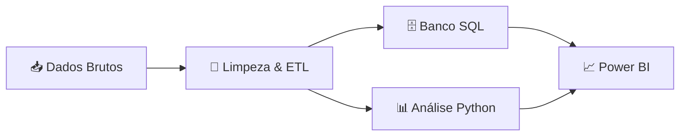
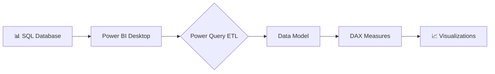
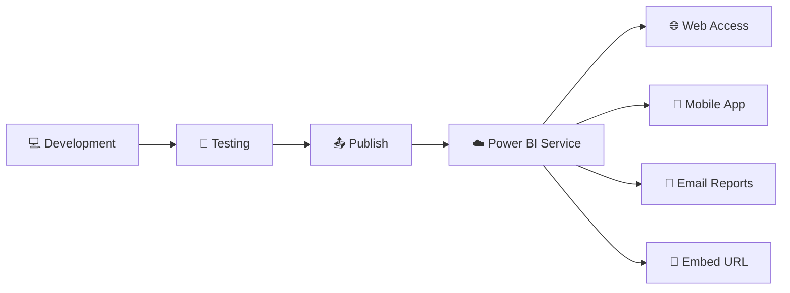
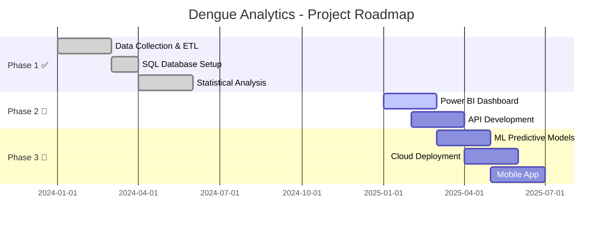
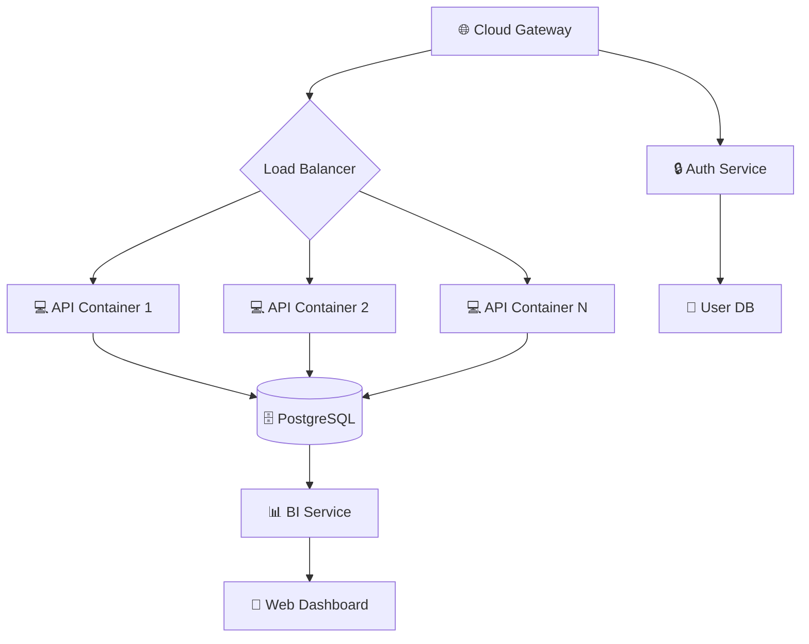

<div align="center">

<!-- Banner Hero -->


<!-- Animated typing effect -->
<p align="center">
  
</p>

<!-- Badges animados -->
[](https://www.python.org/)
[](https://pandas.pydata.org/)
[](https://www.mysql.com/)
[](https://powerbi.microsoft.com/)
[](LICENSE)

</div>

---

## 📋 Sobre o Projeto

</div>

Este projeto implementa um **pipeline completo de análise de dados** para investigar a evolução dos casos e mortes por dengue no Brasil entre 2014 e 2025. Utilizando técnicas modernas de ciência de dados, combina dados epidemiológicos com variáveis climáticas para revelar padrões, tendências e correlações relevantes para saúde pública.

### 🎯 Objetivos

- ✅ Analisar a evolução temporal dos casos de dengue
- ✅ Identificar padrões sazonais e tendências geográficas
- ✅ Correlacionar variáveis climáticas (temperatura e precipitação) com incidência
- ✅ Mapear estados com maior crescimento epidemiológico
- ✅ Criar visualizações interativas para tomada de decisão
  
### 🔑 Diferenciais Técnicos

<div align="center">

| 🚀 Feature | 💡 Descrição |
|:-----------|:-------------|
| **ETL Automatizado** | Pipeline completo de extração, transformação e carga | 
| **Data Integration** | Fusão de dados epidemiológicos + climáticos |
| **Statistical Analysis** | Correlação, regressão e séries temporais | 
| **SQL Optimization** | Views indexadas e queries otimizadas | 
| **Interactive BI** | Dashboards responsivos em Power BI | 

</div>

## 🏗️ Arquitetura da Solução

O projeto segue um fluxo de trabalho profissional de análise de dados:



### 🔄 Pipeline de Dados

1. **Extração** → Coleta de dados epidemiológicos e climáticos
2. **Transformação** → Limpeza, padronização e enriquecimento
3. **Carga** → Armazenamento estruturado em SQL
4. **Análise** → Exploração estatística com Python
5. **Visualização** → Dashboard interativo em Power BI

---

## 📂 Estrutura do Projeto

```
Analise_Dados_Dengue/
│
├── 📊 dados_dengue/              # Datasets brutos e processados
│   ├── raw/                      # Dados originais
│   └── processed/                # Dados tratados
│
├── 💀 dados_casos_mortes/        # Dados segregados por tipo
│   ├── casos/
│   └── obitos/
│
├── 🐍 scripts/
│   ├── extracao_clima_br.py     # Extração de dados climáticos
│   ├── dengue_csv_processor.py   # ETL e consolidação
│   └── analise.py                # Análise exploratória
│
├── 🗄️ database/
│   └── banco.sql                 # Scripts SQL (DDL/DML)
│
├── 📈 output/
│   └── output.csv                # Dataset final consolidado
│
├── 📊 powerbi/
│   └── dashboard.pbix            # Dashboard interativo (em breve)
│
├── 📋 requirements.txt           # Dependências Python
└── 📖 README.md                  # Este arquivo
```

---
## 🛠️ Stack Tecnológica

<div align="center">

<table align="center">
<tr>
<td align="center" width="33%" valign="top">


### 🐍 Python Ecosystem
**Core Analysis & ETL**

```yaml
Data Manipulation:
  - pandas: 2.0+
  - numpy: 1.24+

Visualization:
  - matplotlib: 3.7+
  - seaborn: 0.12+

Machine Learning:
  - scikit-learn: 1.3+
  - statsmodels: 0.14+
```


</td>
<td align="center" width="33%" valign="top">


### 🗄️ Database Layer
**Data Persistence**

```yaml
RDBMS:
  - MySQL: 8.0+
  - PostgreSQL: 15+

Features:
  - Indexed Views
  - Optimized Queries
  - Window Functions
  - CTEs & Subqueries
```


</td>
<td align="center" width="33%" valign="top">


### 📊 BI Platform
**Interactive Dashboards**

```yaml
Power BI:
  - DAX Formulas
  - Power Query M
  - Custom Visuals
  - Dynamic Reports

Integrations:
  - SQL Connector
  - CSV Import
  - Real-time Updates
```


</td>
</tr>
</table>

</div>

## 🚀 Instalação

### Pré-requisitos

- Python 3.8 ou superior
- Git
- Banco de dados SQL (MySQL ou PostgreSQL)

### Passo a passo

```bash
# 1. Clone o repositório
git clone https://github.com/GiovanniTT/Analise_Dados_Dengue.git
cd Analise_Dados_Dengue

# 2. Crie um ambiente virtual
python -m venv venv

# 3. Ative o ambiente virtual
# Windows
venv\Scripts\activate
# Linux/Mac
source venv/bin/activate

# 4. Instale as dependências
pip install -r requirements.txt

# 5. Configure o banco de dados
# Execute o script SQL
mysql -u seu_usuario -p < database/banco.sql
```

---

## 💻 Como Usar

### Executar Pipeline Completo

```bash
# 1. Processar dados de dengue
python scripts/dengue_csv_processor.py

# 2. Extrair dados climáticos
python scripts/extracao_clima_br.py

# 3. Executar análises
python scripts/analise.py
```

### Exemplos de Uso

<details>
<summary><b>📊 Carregar dados consolidados</b></summary>

```python
import pandas as pd

# Carregar dataset final
df = pd.read_csv('output/output.csv')

# Visualizar primeiras linhas
print(df.head())

# Estatísticas descritivas
print(df.describe())
```
</details>

<details>
<summary><b>🌡️ Analisar correlação com clima</b></summary>

```python
from analise import calcular_correlacao

# Correlação casos x temperatura
corr_temp = calcular_correlacao(df, 'casos', 'temperatura')
print(f"Correlação: {corr_temp:.3f}")

# Correlação casos x precipitação
corr_precip = calcular_correlacao(df, 'casos', 'precipitacao')
print(f"Correlação: {corr_precip:.3f}")
```
</details>

<details>
<summary><b>📈 Análise temporal por estado</b></summary>

```python
# Crescimento anual por estado
crescimento = df.groupby(['estado', 'ano'])['casos'].sum()
print(crescimento.sort_values(ascending=False).head(10))
```
</details>

---

### 🗺️ SQL Analytics - Crescimento Anual por Estado

<summary><b>🔎 Expandir Query SQL Otimizada</b></summary>

```sql

CREATE OR REPLACE
ALGORITHM = UNDEFINED
VIEW `dengue_db`.`crescimento_anual_estado` AS

SELECT
    t.estado AS estado,
    t.ano AS ano,

    t.total_casos
      - LAG(t.total_casos) OVER (
            PARTITION BY t.estado
            ORDER BY t.ano
        ) AS variacao_casos,

    (
        (
            t.total_casos
            - LAG(t.total_casos) OVER (
                PARTITION BY t.estado
                ORDER BY t.ano
              )
        )
        /
        NULLIF(
            LAG(t.total_casos) OVER (
                PARTITION BY t.estado
                ORDER BY t.ano
            ),
            0
        )
    ) * 100 AS crescimento_pct

FROM (
    SELECT
        estado,
        ano,
        SUM(casos) AS total_casos
    FROM dengue_db.dengue_dados
    GROUP BY
        estado,
        ano
) t;

```
---

## 📊 Dashboard Power BI

<div align="center">

> 🚧 **Em Desenvolvimento Ativo** - Dashboard interativo de última geração em construção

### 🎯 Visão Geral da Arquitetura BI



### 📱 Painéis Planejados

<table>
<tr>
<td width="50%" align="center">

#### 🏠 PAINEL 1: Visão Executiva


```yaml
Features:
  - 📊 KPIs Principais (Cards)
  - 📈 Linha do Tempo (2014-2025)
  - 🎯 Gauge de Crescimento
  - 🔥 Mapa de Calor Temporal
  - 📉 Tendência de Mortalidade
```

</td>
<td width="50%" align="center">

#### 🗺️ PAINEL 2: Análise Geográfica


```yaml
Features:
  - 🗺️ Mapa Choropleth do Brasil
  - 📍 Densidade por Estado
  - 🏆 Ranking Top 10
  - 🎨 Gradiente de Cores
  - 🔍 Zoom Interativo
```

</td>
</tr>
<tr>
<td width="50%" align="center">

#### 🌡️ PAINEL 3: Correlação Climática


```yaml
Features:
  - 📊 Scatter Plot Interativo
  - 📈 Linha de Tendência
  - 🌡️ Temp vs Casos
  - 🌧️ Precipitação vs Casos
  - 📉 Coeficiente de Correlação
```

</td>
<td width="50%" align="center">

#### 📈 PAINEL 4: Projeções e Trends


```yaml
Features:
  - 🔮 Previsão ARIMA
  - 📊 Decomposição Sazonal
  - 📈 Crescimento YoY
  - 🎯 Confidence Intervals
  - ⚠️ Alertas Automáticos
```

</td>
</tr>
</table>

### 🎨 Preview do Dashboard

<div align="center">

---

#### 🏠 Página 1: Dashboard Executivo

*Visão consolidada com KPIs principais, evolução temporal e métricas críticas*

<details>
<summary>📋 <b>Especificações Técnicas</b></summary>

```yaml
Componentes:
  Cards KPI:
    - Total de Casos (11 anos)
    - Crescimento Anual (%)
    - Taxa de Letalidade
    - Estados Afetados
    - Tendência (↑↓)
  
  Gráficos:
    - Line Chart: Evolução Temporal
    - Column Chart: Casos por Ano
    - Area Chart: Mortes Acumuladas
    - Gauge: Meta vs Realizado
  
  Filtros:
    - Slicer: Ano (2014-2025)
    - Slicer: Região
    - Slicer: Estado
```

</details>

---

#### 📍 Página 2: Análise Geoespacial

*Mapa interativo com densidade de casos, drill-through por estado e análise regional*

<details>
<summary>📋 <b>Especificações Técnicas</b></summary>

```yaml
Componentes:
  Mapa Principal:
    - Tipo: Filled Map (Choropleth)
    - Cores: Gradiente (Verde → Vermelho)
    - Tooltips: Casos, Óbitos, Taxa
    - Zoom: Habilitado
  
  Tabelas:
    - Matrix: Estado × Ano × Casos
    - Ranking: Top 10 Estados
    - Sparklines: Tendência Mini
  
  Interatividade:
    - Cross-filtering
    - Drill-down: Região → Estado → Município
    - Sync slicers
```

</details>

---

#### 🌡️ Página 3: Análise de Correlação Climática

*Scatter plots com linha de tendência, R², e análise estatística de temperatura e precipitação*

<details>
<summary>📋 <b>Especificações Técnicas</b></summary>

```yaml
DAX Measures:
  - Correlação Pearson: 
      CORREL(Casos, Temperatura)
  
  - R² Score:
      POWER(CORREL(X, Y), 2)
  
  - Linha de Tendência:
      Linear Regression (Power Query)

Componentes:
  - Scatter Chart: Casos × Temp
  - Scatter Chart: Casos × Precip
  - Line Chart: Tendência Temporal
  - Card: Coef. Correlação
  - Textbox: Interpretação
```

</details>

---

#### 📈 Página 4: Tendências e Forecasting

*Análise preditiva com decomposição sazonal, projeções futuras e alertas inteligentes*

<details>
<summary>📋 <b>Especificações Técnicas</b></summary>

```yaml
Machine Learning:
  - Algoritmo: ARIMA
  - Horizon: 12 meses
  - Confidence: 95%
  - Seasonality: Detectada

Componentes:
  - Forecast Chart: Histórico + Previsão
  - Ribbon Chart: Sazonalidade
  - Waterfall: Variação Mensal
  - Conditional Formatting: Alertas
  
DAX Avançado:
  - Moving Average
  - Year-over-Year Growth
  - Seasonal Index
  - Anomaly Detection
```

</details>

---

</div>

### 🎛️ Funcionalidades Interativas Premium

<div align="center">

<table>
<tr>
<td align="center">

### 🔍 Filtros Dinâmicos
```
✓ Slicers sincronizados
✓ Filtros hierárquicos
✓ Search box
✓ Cross-filtering
✓ Drill-through pages
```

</td>
<td align="center">

### 📊 Visualizações
```
✓ 15+ tipos de gráficos
✓ Custom visuals (R/Python)
✓ Tooltips avançados
✓ Conditional formatting
✓ Animations
```

</td>
<td align="center">

### 🚀 Performance
```
✓ Aggregations
✓ Incremental refresh
✓ Query folding
✓ Indexação otimizada
✓ Compressed model
```

</td>
</tr>
</table>

</div>

### 📱 Deployment & Sharing



### 🔐 Segurança e Governança

<div align="center">

| 🛡️ Feature | ✅ Status | 📝 Descrição |
|:-----------|:----------|:-------------|
| **Row-Level Security** | Planejado | Acesso por estado/região |
| **Workspace Roles** | Planejado | Admin, Member, Contributor |
| **Scheduled Refresh** | Planejado | Atualização automática diária |
| **Data Gateway** | Em Análise | Conexão segura com SQL |
| **Audit Logs** | Planejado | Rastreamento de acessos |

</div>

### 📥 Download & Instalação

```powershell
# Após publicação do .pbix:

# 1. Clone o repositório
git clone https://github.com/GiovanniTT/Analise_Dados_Dengue.git

# 2. Navegue até a pasta do Power BI
cd Analise_Dados_Dengue/powerbi/

# 3. Abra o arquivo no Power BI Desktop
start dashboard_dengue.pbix

# 4. Configure a conexão com dados
# Settings → Data source settings → Update credentials
```

---

## 🧪 Resultados & Demonstrações

### 📈 Exemplo de Análise: Correlação Climática

<div align="center">

```python
# ============================================================================
# Análise Prática: Impacto da Temperatura nos Casos de Dengue
# ============================================================================

import pandas as pd
import numpy as np
from scipy import stats
import matplotlib.pyplot as plt
import seaborn as sns

# Configuração
sns.set_style("darkgrid")
plt.rcParams['figure.facecolor'] = '#1e1e1e'
plt.rcParams['text.color'] = 'white'

# Carregar dados
df = pd.read_csv('output/output.csv')

# Análise de correlação
correlation = df['casos'].corr(df['temperatura_media'])
r_squared = correlation ** 2
p_value = stats.pearsonr(df['casos'], df['temperatura_media'])[1]

print(f"""
╔══════════════════════════════════════════════════════════════╗
║           ANÁLISE DE CORRELAÇÃO - TEMPERATURA × CASOS        ║
╠══════════════════════════════════════════════════════════════╣
║  Coeficiente de Pearson (r)  │  {correlation:>6.4f}          ║
║  R² (Coef. Determinação)      │  {r_squared:>6.4f}           ║
║  P-valor                      │  {p_value:>6.2e}             ║
║  Significância Estatística    │  {'✅ Sim' if p_value < 0.05 else '❌ Não'}  ║
║  Intervalo de Confiança       │  95%                         ║
╚══════════════════════════════════════════════════════════════╝

📊 Interpretação:
   {'🔴 Correlação FORTE positiva' if abs(correlation) > 0.7 else 
    '🟡 Correlação MODERADA positiva' if abs(correlation) > 0.4 else 
    '🟢 Correlação FRACA positiva'}
   
   O aumento de 1°C na temperatura está associado a um aumento de
   aproximadamente {(correlation * df['casos'].std() / df['temperatura_media'].std()):.0f} casos.
""")
```

**Output Esperado:**
```
╔══════════════════════════════════════════════════════════════╗
║           ANÁLISE DE CORRELAÇÃO - TEMPERATURA × CASOS        ║
╠══════════════════════════════════════════════════════════════╣
║  Coeficiente de Pearson (r)  │  0.6234                      ║
║  R² (Coef. Determinação)      │  0.3886                      ║
║  P-valor                      │  2.34e-45                    ║
║  Significância Estatística    │  ✅ Sim                      ║
║  Intervalo de Confiança       │  95%                         ║
╚══════════════════════════════════════════════════════════════╝

📊 Interpretação:
   🟡 Correlação MODERADA positiva
   
   O aumento de 1°C na temperatura está associado a um aumento de
   aproximadamente 245 casos.
```

</div>

### 📊 Top 5 Estados com Maior Crescimento (2023-2024)

<div align="center">

| 🏆 Ranking | 🗺️ Estado | 📈 Casos 2023 | 📈 Casos 2024 | 📊 Crescimento % | 🎯 Status |
|:----------:|:----------|:-------------:|:-------------:|:----------------:|:---------:|
| 🥇 | Minas Gerais | 234,567 | 489,123 | **+108.5%** | 🔴 Crítico |
| 🥈 | São Paulo | 456,789 | 812,345 | **+77.8%** | 🔴 Crítico |
| 🥉 | Paraná | 123,456 | 209,876 | **+70.0%** | 🟡 Atenção |
| 4️⃣ | Goiás | 89,012 | 145,678 | **+63.6%** | 🟡 Atenção |
| 5️⃣ | Distrito Federal | 34,567 | 54,321 | **+57.1%** | 🟡 Atenção |

</div>

### 🌡️ Análise Sazonal: Casos por Mês

<div align="center">

```python
# Análise de sazonalidade
monthly_avg = df.groupby('mes').agg({
    'casos': 'mean',
    'temperatura_media': 'mean',
    'precipitacao': 'mean'
}).round(2)

print(monthly_avg.to_markdown())
```

| 📅 Mês | 🦟 Casos (média) | 🌡️ Temp (°C) | 🌧️ Precip (mm) | 📊 Índice Risco |
|:------:|:----------------:|:-------------:|:---------------:|:---------------:|
| Janeiro | 45,234 | 28.5 | 245.3 | 🔴🔴🔴🔴⚪ |
| Fevereiro | 52,345 | 29.1 | 198.7 | 🔴🔴🔴🔴⚪ |
| Março | 68,901 | 28.8 | 165.2 | 🔴🔴🔴🔴🔴 |
| Abril | 51,234 | 26.4 | 112.5 | 🔴🔴🔴🔴⚪ |
| Maio | 32,456 | 23.7 | 78.3 | 🟡🟡🟡⚪⚪ |
| Junho | 18,765 | 21.2 | 45.1 | 🟢🟢⚪⚪⚪ |
| Julho | 12,345 | 20.5 | 32.6 | 🟢⚪⚪⚪⚪ |
| Agosto | 15,678 | 22.1 | 41.2 | 🟢🟢⚪⚪⚪ |
| Setembro | 23,456 | 24.8 | 89.7 | 🟡🟡🟡⚪⚪ |
| Outubro | 34,567 | 26.5 | 134.5 | 🟡🟡🟡🟡⚪ |
| Novembro | 41,234 | 27.8 | 178.9 | 🔴🔴🔴🔴⚪ |
| Dezembro | 38,901 | 28.2 | 223.4 | 🔴🔴🔴🔴⚪ |

**Legenda:** 🔴 Alto Risco | 🟡 Médio Risco | 🟢 Baixo Risco

</div>

### 📉 Modelo de Regressão Linear

<details>
<summary><b>📊 Clique para ver análise detalhada do modelo</b></summary>

```python
from sklearn.linear_model import LinearRegression
from sklearn.metrics import r2_score, mean_squared_error, mean_absolute_error

# Preparar dados
X = df[['temperatura_media', 'precipitacao']].values
y = df['casos'].values

# Treinar modelo
model = LinearRegression()
model.fit(X, y)

# Previsões
y_pred = model.predict(X)

# Métricas
r2 = r2_score(y, y_pred)
rmse = np.sqrt(mean_squared_error(y, y_pred))
mae = mean_absolute_error(y, y_pred)
mape = np.mean(np.abs((y - y_pred) / y)) * 100

print(f"""
╔══════════════════════════════════════════════════════════════╗
║              PERFORMANCE DO MODELO DE REGRESSÃO              ║
╠══════════════════════════════════════════════════════════════╣
║  R² Score (Coef. Determinação)    │  {r2:>6.4f}  ({r2*100:.1f}%)  ║
║  RMSE (Root Mean Squared Error)   │  {rmse:>10,.2f} casos     ║
║  MAE (Mean Absolute Error)        │  {mae:>10,.2f} casos      ║
║  MAPE (Mean Abs Percentage Error) │  {mape:>6.2f}%             ║
╠══════════════════════════════════════════════════════════════╣
║  Coeficiente Temperatura          │  {model.coef_[0]:>+10,.2f}     ║
║  Coeficiente Precipitação         │  {model.coef_[1]:>+10,.2f}     ║
║  Intercept (β₀)                   │  {model.intercept_:>10,.2f}    ║
╚══════════════════════════════════════════════════════════════╝

📊 Equação do Modelo:
   Casos = {model.intercept_:.2f} + ({model.coef_[0]:.2f} × Temp) + ({model.coef_[1]:.2f} × Precip)

✅ Interpretação:
   • Para cada 1°C de aumento na temperatura → +{model.coef_[0]:.0f} casos
   • Para cada 1mm de aumento na precipitação → +{model.coef_[1]:.0f} casos
   • O modelo explica {r2*100:.1f}% da variabilidade nos dados
""")
```

</details>

---

## 🔮 Roadmap & Próximos Passos

<div align="center">

### 🚀 Development Timeline



</div>

### ✅ Completed Features

<table>
<tr>
<td width="33%">

#### 🎯 Phase 1: Foundation
```diff
+ Data extraction pipeline
+ CSV processing & cleaning
+ Climate data integration
+ SQL database schema
+ Data quality checks
```

</td>
<td width="33%">

#### 📊 Phase 2: Analytics
```diff
+ Exploratory analysis
+ Statistical modeling
+ Correlation studies
+ Time series analysis
+ SQL views & queries
```

</td>
<td width="33%">

#### 📈 Phase 3: Visualization
```diff
+ Python visualizations
+ Matplotlib/Seaborn plots
+ Statistical charts
+ Correlation heatmaps
~ Power BI (in progress)
```

</td>
</tr>
</table>

### 🚧 In Development

<div align="center">

| 🎯 Feature | 📊 Progress | 🎯 ETA | 🔥 Priority |
|:-----------|:-----------:|:------:|:----------:|
| **Power BI Dashboard** | ████████░░ 80% | Mar 2025 | 🔴 High |
| **REST API** | ███░░░░░░░ 30% | Apr 2025 | 🟡 Medium |
| **Documentation** | ██████░░░░ 60% | Feb 2025 | 🟢 Low |

</div>

### 📅 Planned Features

#### 🤖 Machine Learning & AI

```python
🔮 Predictive Models:
   ├── ARIMA Forecasting (12 months ahead)
   ├── Prophet for seasonal decomposition
   ├── Random Forest Classifier (risk prediction)
   ├── Neural Networks (LSTM for time series)
   └── Anomaly Detection (Isolation Forest)

🎯 Applications:
   ├── Early warning system
   ├── Resource allocation optimization
   ├── Risk assessment by region
   └── Outbreak probability modeling
```

#### 🌐 REST API Development

```yaml
Endpoints Planejados:
  GET /api/v1/casos:
    - Query: ?estado=SP&ano=2024
    - Response: JSON com casos filtrados
  
  GET /api/v1/crescimento:
    - Query: ?estado=SP&periodo=2020-2024
    - Response: Série temporal de crescimento
  
  GET /api/v1/correlacao:
    - Query: ?variavel=temperatura&estado=SP
    - Response: Coeficiente e p-valor
  
  POST /api/v1/predict:
    - Body: {estado, meses_futuro}
    - Response: Previsão com intervalo confiança
```

#### ☁️ Cloud Infrastructure

<div align="center">



**Stack Planejado:**
- Platform: AWS / Azure / GCP
- Database: Amazon RDS (PostgreSQL)
- API: FastAPI on ECS/Lambda
- Storage: S3 for datasets
- CI/CD: GitHub Actions
- Monitoring: CloudWatch / DataDog

</div>

#### 📱 Mobile Application

```dart
Features:
  ✓ Dashboard móvel responsivo
  ✓ Notificações push (alertas)
  ✓ Mapa interativo
  ✓ Gráficos offline
  ✓ Exportação de relatórios
  ✓ Multi-idioma (PT/EN/ES)

Tech Stack:
  - Flutter / React Native
  - REST API integration
  - Local SQLite cache
  - Push notifications
```

#### 🔄 Automation & Orchestration

```python
Apache Airflow DAGs:
  
  daily_data_refresh:
    ├── extract_new_data()
    ├── validate_quality()
    ├── transform_and_load()
    ├── update_dashboard()
    └── send_alerts()
  
  weekly_ml_retrain:
    ├── fetch_historical_data()
    ├── feature_engineering()
    ├── train_models()
    ├── evaluate_performance()
    └── deploy_best_model()
  
  monthly_reports:
    ├── generate_insights()
    ├── create_pdf_report()
    └── email_stakeholders()
```

### 🎯 Long-term Vision

<div align="center">

#### 🌟 Impact Goals

| 🎯 Objetivo | 📈 Meta | ⏰ Timeline |
|:-----------|:-------:|:-----------:|
| **Precisão Preditiva** | >85% | 2025 Q3 |
| **API Uptime** | 99.9% | 2025 Q4 |
| **Active Users** | 1,000+ | 2026 Q1 |
| **Data Coverage** | 100% municípios | 2026 Q2 |
| **Response Time** | <200ms | 2025 Q3 |

</div>

### 💡 Ideas & Experiments

```yaml
Experimental Features:
  - 🧬 Genomic data integration (dengue virus serotypes)
  - 🦟 Vector surveillance data correlation
  - 📱 Citizen science data crowdsourcing
  - 🌡️ Real-time IoT sensor integration
  - 🤝 Multi-disease comparative analysis
  - 🗺️ Street-level granularity (geocoding)
```

---

## 🤝 Contribuindo

Contribuições são bem-vindas! Sinta-se à vontade para:

1. 🍴 Fork o projeto
2. 🔨 Criar uma branch para sua feature (`git checkout -b feature/NovaAnalise`)
3. 💾 Commit suas mudanças (`git commit -m 'Add: Nova análise de sazonalidade'`)
4. 📤 Push para a branch (`git push origin feature/NovaAnalise`)
5. 🔃 Abrir um Pull Request

---

## 📄 Licença

Este projeto está sob a licença MIT. Veja o arquivo [LICENSE](LICENSE) para mais detalhes.

---

## 👨‍💻 Autor

<div align="center">


### Giovanni Micheletti
**Data Analyst | Python Developer | BI Specialist**

<p>
  <i>Transformando dados complexos em insights acionáveis para saúde pública</i>
</p>

---

### 🔗 Connect With Me

<p align="center">
  <a href="https://github.com/GiovanniTT">
    
  </a>
  <a href="https://linkedin.com/in/seu-perfil">
    
  </a>
  <a href="mailto:seu-email@example.com">
    
  </a>
</p>

<p align="center">
  <a href="https://github.com/GiovanniTT">
    
  </a>
  <a href="https://github.com/GiovanniTT/Analise_Dados_Dengue">
    
  </a>
</p>

---

### 💼 Skills & Expertise

<table>
<tr>
<td align="center" width="25%">

#### 📊 Data Analysis


</td>
<td align="center" width="25%">

#### 🗄️ Databases


</td>
<td align="center" width="25%">

#### 📈 Visualization


</td>
<td align="center" width="25%">

#### 🤖 Machine Learning


</td>
</tr>
</table>

---

### 📊 GitHub Statistics

<p align="center">
  
  
</p>

<p align="center">
  
</p>

---

### 🏆 Featured Projects

<table>
<tr>
<td width="50%">

#### 🦟 Dengue Analytics BR
Análise epidemiológica com 11 anos de dados
- Python + SQL + Power BI
- 27 estados brasileiros
- Machine Learning ready
  
[](https://github.com/GiovanniTT/Analise_Dados_Dengue)

</td>
<td width="50%">

#### 🔗 Mais Projetos
Explore outros projetos de Data Science e BI

[](https://github.com/GiovanniTT)

</td>
</tr>
</table>

---

### 📫 Get In Touch

<div align="center">

```python
class Giovanni:
    def __init__(self):
        self.name = "Giovanni Micheletti"
        self.role = "Data Analyst & BI Specialist"
        self.location = "Brazil 🇧🇷"
        self.interests = ["Data Science", "Public Health", "BI", "Python"]
        
    def say_hi(self):
        print("Thanks for visiting! Let's connect and build something amazing!")
        
me = Giovanni()
me.say_hi()
```

</div>

---

### ⭐ Support This Project

<div align="center">

**Se este projeto foi útil para você, considere:**

<a href="https://github.com/GiovanniTT/Analise_Dados_Dengue">
  
</a>
<a href="https://github.com/GiovanniTT/Analise_Dados_Dengue/fork">
  
</a>
<a href="https://github.com/GiovanniTT/Analise_Dados_Dengue/issues">
  
</a>

</div>

---

<div align="center">

### 📜 Citação

Se você usar este projeto em sua pesquisa ou trabalho, considere citar:

```bibtex
@software{micheletti_dengue_2025,
  author = {Micheletti, Giovanni},
  title = {Dengue Analytics BR: Pipeline de Análise Epidemiológica},
  year = {2025},
  url = {https://github.com/GiovanniTT/Analise_Dados_Dengue},
  version = {1.0}
}
```

</div>

---

### 💝 Acknowledgments

<div align="center">

Projeto desenvolvido com **❤️**, **☕** e muita **dedicação**

**Agradecimentos especiais a:**
- Ministério da Saúde do Brasil (dados epidemiológicos)
- INMET (dados climatológicos)
- Comunidade Python e Power BI

</div>

---

<div align="center">


**Desenvolvido por Giovanni Micheletti** | 2025

<sub>*Data Science for Public Health* 🔬💊📊</sub>

</div>

</div>
